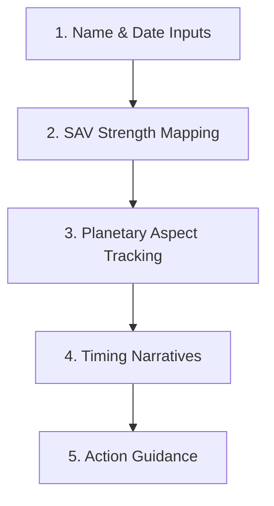

# Antara: Timing Intelligence Reference Guide
## Strategic Timing, SAV Patterns & Chronobiology Framework

This document serves as the core reference guide for the timing engine used in `07_transits.html`. It outlines the five timing layers, the chronobiology narrative system, and the interpretation logic used throughout the platform.

The focus is not prediction.
The focus is timing intelligence.

---

## 1. The Timing Intelligence Stack

Traditional astrology often relies on static forecasts or generalized interpretations. Antara instead uses a layered timing model designed to help users understand:

* momentum
* pressure cycles
* recovery windows
* strategic pacing
* decision timing

1. **Input & Calibration**
   Tracks the user’s birth data, name signature, and target date.
2. **SAV Strength Mapping**
   Measures supportive and pressured areas using Ashtakavarga point scoring.
3. **Planetary Aspect Tracking**
   Calculates active alignments, orbital movement, and timing pressure points.
4. **Timing Narratives**
   Generates layered timing guidance across work, relationships, health, and focus.
5. **Action Guidance**
   Converts timing patterns into practical recommendations and recovery strategies.

---

## 2. The Five Timing Panels

The dashboard organizes active timing conditions into five clear interpretation layers.

### Module 1: Precision Timing Layer
*Purpose: Identifies exact interaction points between transits and the birth chart.*

* **Exact Alignments**
  Triggered when a moving planet comes within 1.5° of a natal placement.
  *Example*: `"Transiting Saturn aligns closely with Natal Mercury, increasing mental pressure and strategic seriousness."`
* **House Crossings**
  Flags when slow-moving planets shift into major life sectors, changing environmental priorities.
* **Stationary Phases**
  Highlights periods when outer planets slow down before reversing direction, intensifying pressure around specific themes.

---

### Module 2: Strength & Stability Layer
*Purpose: Measures supportive versus pressured timing zones using SAV scoring.*

* **Saturn SAV**
  * *High SAV (30+)*: `"Strong support for disciplined execution, systems building, and long-term effort."`
  * *Low SAV (<30)*: `"Pressure rises around workload, delays, and operational resistance. Simplify expansion plans."`
* **Jupiter SAV**
  * *High SAV (25+)*: `"Favorable timing for launches, investments, negotiations, and growth."`
  * *Low SAV (<25)*: `"Opportunities still exist, but progress requires sharper focus and consistent effort."`
* **Dignity Tracking**
  Evaluates unusual planetary positioning that may amplify or soften timing conditions.

---

### Module 3: Timing Windows Layer
*Purpose: Tracks duration, momentum shifts, and activation periods.*

* **Peak Windows**
  Maps periods when important cycles become most active.
* **Slowing Cycles**
  Identifies periods where planetary movement slows, extending pressure or focus themes.
* **Activation Windows**
  Highlights short periods when fast-moving planets trigger larger long-term cycles.

---

### Module 4: Eclipse & Nodal Layer
*Purpose: Tracks reset periods and major directional shifts.*

* **Eclipse Hotspots**
  Triggered when eclipses align closely with sensitive birth-chart positions.
* **Multi-System Confirmation**
  Cross-checks overlapping timing signals across multiple systems including BaZi and progressed alignments.

---

### Module 5: Action Guidance Layer
*Purpose: Converts timing analysis into practical decision support.*

* **Momentum Windows**
  * *Theme*: Use favorable cycles to move forward decisively.
  * *Suggested Actions*:
    - launch initiatives
    - negotiate agreements
    - allocate capital
    - expand strategically
    - delegate systematically
* **Consolidation Windows**
  * *Theme*: Reduce pressure, protect resources, and strengthen foundations.
  * *Suggested Actions*:
    - delay speculative risks
    - simplify operations
    - review contracts
    - conduct audits
    - stabilize systems
* **Environmental Adjustments**
  * *Theme*: Support recovery, focus, and mental clarity.
  * *Suggested Actions*:
    - reduce overstimulation
    - optimize workspace orientation
    - introduce grounding environments
    - maintain restorative pacing

---

## 3. The Six Timing Chapters

The Chronobiology Portfolio converts calculations into a layered timing guide.

### Chapter 1: Executive Dashboard
*Purpose: Provides the high-level timing overview.*

* **Core Areas**:
  1. *Long-Term Timing*: Identifies whether the user is in a growth, rebuilding, consolidation, or transition phase.
  2. *Short-Term Action Windows*: Highlights favorable versus cautious timing periods.
  3. *Life Allocation Tracks*: Maps cycles across work & finance, relationships, and energy & recovery.
  4. *Stability Guidance*: Provides practical controls during heavier cycles.
* **Example Questions**:
  * *"What is my dominant theme this year?"* $\rightarrow$ **Answer**: *"This is a systems-building phase focused on execution and structure."*
  * *"Where is support strongest right now?"* $\rightarrow$ **Answer**: *"Career and governance sectors are currently well-supported."*
  * *"How long will current pressure last?"* $\rightarrow$ **Answer**: *"Conditions begin easing after Saturn completes its stationary phase in late July."*

---

### Chapter 2: Long-Term Cycles
*Purpose: Maps the larger developmental chapter currently shaping the user’s life.*

* *Example*: `"Your current Jupiter phase emphasizes expansion, learning, and strategic growth. Progress strengthens when vision is matched with disciplined execution."`

---

### Chapter 3: Short-Term Timing
*Purpose: Tracks the immediate sub-cycles influencing current priorities.*

* *Example*: `"The current Saturn sub-cycle emphasizes structure, discipline, and operational cleanup. This is a period for simplifying systems and strengthening foundations."`

---

### Chapter 4: Pressure & Protection Map
*Purpose: Combines transits with SAV scoring to identify stable versus exposed areas.*

* *Example*: `"Saturn currently pressures career responsibilities, but strong SAV support increases long-term stability and productive outcomes."`

---

### Chapter 5: Practical Guidance
*Purpose: Converts timing patterns into clear behavioral recommendations.*

* **Work & Finance**:
  - align launches with supportive timing windows
  - reduce speculative exposure during pressure phases
  - focus on long-term systems over impulsive expansion
* **Relationships & Leadership**:
  - prioritize alignment over rapid scaling
  - strengthen delegation and communication structures
* **Health & Recovery**:
  - match physical pacing with workload intensity
  - maintain restorative movement and recovery cycles

---

### Chapter 6: Pause & Recovery Blueprint
*Purpose: Provides recovery strategies during heavy timing periods.*

* *Example*: `"Schedule focused, low-interruption work periods during high-pressure cycles to restore clarity and reduce decision fatigue."`
* **Environmental Guidance**:
  - *Example*: `"For focused analytical work, use calm and grounded environments that reduce distraction and mental overload."`

---

## 4. Tone & Interpretation Principles

### Timing, Not Fate
Antara frames astrology as timing intelligence rather than fixed destiny.

* *Examples*:
  - **Saturn** = systems review
  - **Jupiter** = expansion window
  - **Mercury retrograde** = review and recalibration phase

The goal is not prediction.
The goal is better pacing, awareness, and strategic timing.

---

## 5. Calibration Reference

To test the transit engine, celestial map interactions, and timing overlays, use the following reference profile:

* **User Name**: Srinivas Ramanujan
* **Birth Date**: 1989-11-09
* **Target Date**: 2026-02-20
* **Location**: Kumbakonam, Tamil Nadu, India

*Expected Result*: Generates multiple overlapping high-intensity aspect interactions simultaneously.
