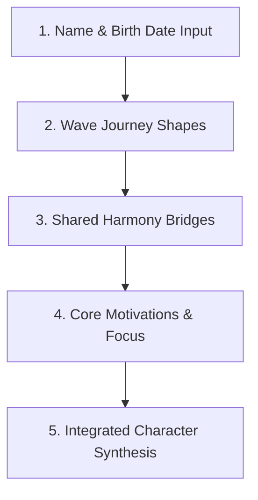

# Antara: Symbolic Pattern Analytics Reference Manual
## Visual Journey & Personal Narrative Archetypes Library

This manual serves as the master register and conceptual map for the **identity narrative mapping system** implemented in `02_identity.html`. If you need to reference, audit, or expand the copy, algorithms, or archetypes in the future, this document is your single source of truth.

---

## 1. The Architectural Stack
Most traditional systems stop at a simple *number $\rightarrow$ meaning* conversion. Antara introduces a highly modern, elegant 5-layer narrative framework:



1. **Wave Journey (Personal Energy Flow)**: Tracks how your signature name coordinates rise, settle, or flow, indicating your natural style of channelling energy.
2. **Shared Harmony (Inner & Outer Path Alignment)**: Maps how your inner values (self-intent) and outer spoken resonance (public presence) intersect.
3. **Core Motivations (Carrying Vowel Tones)**: Explores the carrying breath of vowels to locate deep, atmospheric motivators (Intuitive, Relational, or Grounded) along with supportive coping styles.
4. **Personal Steering (How You Focus / Compass)**: Measures the balance between personal principles and social adaptability (your internal compass).
5. **Integrated Character (Dynamic Profile Synthesis)**: Integrates journey shape, personal steering, and birth date to reveal a complete, dynamic personal profile.

---

## 2. Narrative Rotation & Character Flow (String-Hashing)
To ensure the reading feels organic, custom-tailored, and fluid for different names while preserving absolute consistency (ensuring the same name always generates the exact same reading), we use a deterministic string-hash selector:

```javascript
function getDeterministicOption(name, optionsPool) {
  let hash = 0;
  for (let i = 0; i < name.length; i++) {
    hash = name.charCodeAt(i) + ((hash << 5) - hash);
  }
  const index = Math.abs(hash) % optionsPool.length;
  return optionsPool[index];
}
```
This algorithm maps any name signature to a stable numerical index, rotating between 3 distinct opening sentences, cadence styles, and positive-neutral tension balances.

---

## 3. Layer 1: ✦ Wave Journey (Personal Energy Flow)
*Calculated from coordinate transitions and profile limits.*

### 1. Mountain Profile
*Trigger: Peak coordinate sits in the center.*
* **Option A**: `"a centered peak or mountain profile, bringing quiet strength, stability, and a reassuring presence."`
* **Option B**: `"a centered peak or mountain profile. This shape highlights a focused and calm operational stance, helping anchor environments and bring clarity to others."`
* **Option C**: `"a centered peak or mountain profile, bringing a solid personal focus that projects quiet strength, though this deep dedication can sometimes make it harder to pivot quickly."`

### 2. Valley Pattern
*Trigger: Lowest coordinate sits in the center.*
* **Option A**: `"a receptive valley pattern, showing an exceptional capacity for deep listening, quiet reflection, and synthesis."`
* **Option B**: `"a receptive valley pattern. This profile indicates a highly observant and reflective inner space, choosing careful synthesis over hasty action."`
* **Option C**: `"a receptive valley pattern, reflecting comfort with silent reflection and deep listening, ensuring choices are fully considered before acting."`

### 3. Dynamic Wave
*Trigger: High transition delta ($> 3.8$).*
* **Option A**: `"a dynamic and creative contrast wave, showing a natural adaptability to transitions and expressive changes."`
* **Option B**: `"a dynamic and creative contrast wave. This versatile energy rhythm thrives on fresh perspectives and expressive transitions, though navigating these changes can occasionally feel intensive."`
* **Option C**: `"a dynamic and creative contrast wave, carrying a high-contrast personal presence that values creative versatility, reinvention, and fresh perspectives."`

### 4. Ascending Curve
*Trigger: Ending coordinate is $\ge 2$ points higher than start.*
* **Option A**: `"a steady, upward-building curve, showing a gradual expansion of personal visibility and momentum, transitioning quietly into recognized progress."`
* **Option B**: `"a steady, upward-building curve. This pattern represents a growth-oriented focus, starting projects quietly before building strong, visible momentum."`
* **Option C**: `"a steady, upward-building curve, reflecting a purposeful rise in momentum and growth, guided by a quiet but exceptionally persistent focus."`

### 5. Grounding Arc
*Trigger: Starting coordinate is $\ge 2$ points higher than end.*
* **Option A**: `"a grounding arc, bringing practical focus, stabilizing influence, and the steady integration of ideas into lasting, concrete results."`
* **Option B**: `"a grounding arc. This geometry points to an operational focus on consolidation, showing the patience needed to bring early concepts down to earth."`
* **Option C**: `"a grounding arc, conveying a stabilizing influence that values order, practicality, and the methodical translation of broad ideas into concrete reality."`

### 6. Balanced Wave
*Trigger: Normal undulating waves (Default).*
* **Option A**: `"a balanced, undulating wave, illustrating natural composure, organic rhythm, and calm adaptability when navigating life's changes."`
* **Option B**: `"a balanced, undulating wave. This flowing geometry projects a calm personal equilibrium, although this strong preference for harmony can sometimes lead to leaving necessary friction unvoiced."`
* **Option C**: `"a balanced, undulating wave, carrying an organic rhythm that helps navigate transitions with personal equilibrium and calm composure."`

### 7. Linear Path
*Trigger: 2 characters or fewer.*
* **Option A**: `"a direct, linear path, showing absolute clarity, concise focus, and simple, high-impact action."`
* **Option B**: `"a direct, linear path. This geometry indicates a clear preference for cutting through complexity with immediate, concentrated focus."`
* **Option C**: `"a direct, linear path. This structure conveys absolute clarity and a highly efficient, purposeful focus, bypassing distractions with immediate action."`

---

## 4. Layer 2: ✦ Shared Harmony (Inner & Outer Path Alignment)
*Maps how self-intent and public presence intersect at matching sound coordinates.*

### 1. Resonant Overlap (Intersections $\ge 3$)
* **Option A**: `"This alignment reveals a highly Shared Harmony, with multiple crossing points at the letters [A, B]. This indicates that your inner thoughts and spoken voice operate in complete, natural alignment."`
* **Option B**: `"This alignment points to a highly Shared Harmony intersecting at [A, B], where private self-intent and public presence flow together, fostering a highly authentic personal presence."`
* **Option C**: `"These pathways reveal a highly Shared Harmony at the characters [A, B], showing that inner ideals and outer projection operate in close, cooperative balance."`

### 2. Harmonic Bridge (Intersections $1-2$)
* **Option A**: `"This configuration points to a Harmonic Bridge at key crossing points ([A]). These characters act as natural bridges, helping you translate your private thoughts into clear, visible contributions."`
* **Option B**: `"These paths reveal a Harmonic Bridge at the letters [A]. These specific characters serve as expressive bridges, allowing you to project a rich inner landscape into visible contributions."`
* **Option C**: `"This alignment highlights a Harmonic Bridge at key intersections ([A]). These letters act as expressive bridges, supporting a clear translation of quiet, private values into public action."`

### 3. Parallel Paths (Intersections $0$)
* **Option A**: `"These paths follow independent routes, suggesting a creative dual-path flow where a rich, private inner world operates alongside a highly versatile outer presence."`
* **Option B**: `"These trajectories track separate pathways, showing a private, reflective inner world that feeds a highly versatile public presence."`
* **Option C**: `"This configuration illustrates independent pathways, indicating a dual-path flow where your reflective inner landscape informs a highly adaptive public presence."`

---

## 5. Layer 3: ✦ Core Motivations (Carrying Vowel Tones)
*Calculated from the average values of carrying vowels, refined with supportive coping dynamics.*

### 1. Structured Vowel Core (No Vowels)
* **Option A**: `"This consonant-focused pattern points to a practical drive toward immediate execution, structural order, and clear boundaries."`
* **Option B**: `"This configuration reflects a consonant-focused drive, illustrating a clear preference for operational execution, structural order, and highly consistent boundaries."`

### 2. Intuitive Core (Average $\ge 5.5$)
* **Option A**: `"This configuration reveals an Intuitive Core (vowel score: [X.X]). You thrive on conceptual space, visions, and broad horizons. Under pressure, your natural tendency is to step back into high-level strategy or future planning. In relationships, you value deep intellectual exploration, making choices based on bold inspiration rather than safe checklists."`
* **Option B**: `"The underlying vowel pattern points to an Intuitive Core (vowel average: [X.X]). This profile brings an imaginative, forward-looking focus that looks past current limits. Your relational style seeks deep, supportive connections that encourage growth. When confronting day-to-day routines under stress, your coping stance may involve a subtle detachment, preferring abstract planning over procedural details."`
* **Option C**: `"This vowel mapping illustrates an Intuitive Core (vowel index: [X.X]). It reflects a preference for conceptual depth and visionary ideas. Decisions are made through intuitive alignment with long-term potential, creating a highly inspiring yet occasionally unanchored presence in structured teams."`

### 3. Relational Core (Average $\ge 3.0$ and $< 5.5$)
* **Option A**: `"This configuration reveals a Relational Core (vowel score: [X.X]). You are naturally attuned to shared trust, collaboration, and emotional harmony. In partnerships, you value mutual support. Under pressure, your instinct is to check the emotional climate of the group, occasionally choosing to delay difficult boundaries or conversations to keep the peace."`
* **Option B**: `"The underlying vowel pattern points to a Relational Core (vowel average: [X.X]). This profile fosters an atmosphere of active listening and mutual support. In partnerships, there is a strong drive for deep emotional understanding. Under stress, the coping response is to gather input and check the collective emotional temperature before initiating any changes."`
* **Option C**: `"This vowel mapping illustrates a Relational Core (vowel index: [X.X]). It reflects an atmospheric sensitivity to group alignment. In team settings, this manifests as a skilled capacity to read unvoiced group needs, seeking paths that protect collaborative trust rather than pushing individual, disruptive agendas."`

### 4. Grounded Core (Average $< 3.0$)
* **Option A**: `"This configuration reveals a Grounded Core (vowel score: [X.X]). You are practical, reliable, and execution-focused, acting as a steady anchor for those around you. Under stress, you find safety in concrete checklists, orderly steps, and immediate reality before looking toward long-term conceptual changes."`
* **Option B**: `"The underlying vowel pattern points to a Grounded Core (vowel average: [X.X]). It projects a reassuring, stabilizing influence, ensuring that concepts are securely execution-tested. Decision-making is historical and metric-driven. When facing rapid or unproven changes, however, the coping stance may resist these transitions until stable parameters are fully demonstrated."`
* **Option C**: `"This vowel mapping illustrates a Grounded Core (vowel index: [X.X]). Relational style relies on steady, slow-building foundations rather than quick bonds. In collaborative environments, this translates to acting as a reliable operational anchor, preferring methodical progress and absolute clarity over open-ended, shifting conceptual ideas."`

---

## 6. Layer 4: ✦ Personal Steering (How You Focus / Compass)
*Calibrates inner self-intent against outer public presence.*

### 1. Unified Compass (Difference $< 0.4$)
* **Option A**: `"This configuration illustrates a Unified Focus (inner intent [X.X] vs. outer presence [X.X]), reflecting a balanced equilibrium between private conviction and public projection, combining strong personal standards with a highly polished public presence."`
* **Option B**: `"This relationship points to a Unified Focus (inner intent [X.X] vs. outer presence [X.X]). This indicates a natural balance between private values and social warmth, although maintaining this constant alignment can sometimes limit your expressive range."`
* **Option C**: `"These pathways reflect a Unified Focus (inner intent [X.X] vs. outer presence [X.X]), indicating that private convictions and public style cooperate in a natural, balanced equilibrium."`

### 2. Internal Compass (Inner self-intent average higher)
* **Option A**: `"This configuration points to an Internal Compass (inner focus [X.X] is higher than outer presence [X.X]), showing that your primary compass is formed by personal conviction rather than outside consensus, keeping you steady in changing environments."`
* **Option B**: `"This configuration points to an Internal Compass (inner focus [X.X] vs. outer presence [X.X]). This indicates you are guided primarily by private standards rather than outside approval, keeping you exceptionally steady, although sometimes less responsive to external feedback."`
* **Option C**: `"These pathways illustrate an Internal Compass (inner focus [X.X] is higher than outer presence [X.X]), revealing that private convictions serve as the main anchor, ensuring your public steps remain aligned with inner ideals."`

### 3. Resonant Compass (Outer public presence average higher)
* **Option A**: `"This configuration highlights a Resonant Compass (outer presence [X.X] is higher than inner focus [X.X]), revealing a natural warmth and active social adaptability that makes it easy to build immediate trust and shape how others receive your presence."`
* **Option B**: `"This relationship points to a Resonant Compass (outer presence [X.X] vs. inner focus [X.X]). This shows a warm, highly receptive outer presence, although this strong focus on environmental alignment can sometimes lead to prioritizing external harmony over private needs."`
* **Option C**: `"These pathways illustrate a Resonant Compass (outer presence [X.X] is higher than inner focus [X.X]), revealing a warm, highly receptive outer projection that naturally adapts to social environments and builds instant, reassuring rapport."`

---

## 7. Layer 5: The Meta-Layer (Integrated Character Archetypes)
*Synthesized dynamically from the interaction between Layer 1 (Shape) and Layer 4 (Steering), then overlayed with a Date of Birth (DoB) Emotional Subvariant.*

### Part I: Baseline Meta-Archetype Grid
| Trajectory Shape (L1) | Internal Compass (L4) | Resonant Compass (L4) | Unified Focus (L4) |
| :--- | :--- | :--- | :--- |
| **Dynamic Wave** | **The Expressive Navigator** | **The Resonant Adaptor** | **The Visionary Catalyst** |
| **Mountain Profile** | **The Anchored Lighthouse** | **The Centered Mediator** | **The Grounded Guardian** |
| **Valley Pattern** | **The Reflective Analyst** | **The Empathic Mirror** | **The Quiet Synthesizer** |
| **Ascending Curve** | **The Principled Achiever** | **The Adaptive Growth Lead** | **The Purposeful Builder** |
| **Grounding Arc** | **The Pragmatic Anchor** | **The Stabilizing Integrator** | **The Grounded Builder** |
| **Balanced / Flowing** | **The Independent Integrator** | **The Harmonious Adaptor** | **The Adaptive Integrator** |

### Part II: Birth Date Subvariant Overlay
*Calculated by summing all digits in the birth date, reducing to a coordinate from 1 to 9.*

1. **DoB Root 1: The Resolute Pioneer** (resolute, initiating focus)
   * *Relational Context*: In collaborative environments, you bring an initiating momentum that breaks through hesitation, acting as the driving force for new projects or alignments.
   * *Core Decisions*: When confronting major transitions, your decision style is swift and resolute, trusting early indicators to secure progress before other systems align.
2. **DoB Root 2: The Receptive Harmonizer** (receptive, collaborative focus)
   * *Relational Context*: In collaborative teams, you act as the quiet glue, observing relational currents and naturally facilitating alignment between competing viewpoints.
   * *Core Decisions*: In core decisions, you gather extensive consensus, choosing to defer rapid pivots until all stakeholders are operationally synchronized.
3. **DoB Root 3: The Resonant Expresser** (resonant, creative focus)
   * *Relational Context*: In collaborative environments, you project an inspiring, expressive atmosphere, translating complex team sentiments into clear, high-recall strategies.
   * *Core Decisions*: When navigating strategic pivots, you rely on creative resonance, testing decisions against their long-term conceptual impact and relational authenticity.
4. **DoB Root 4: The Methodical Architect** (structured, detail-focused focus)
   * *Relational Context*: In collaborative teams, you project a reassuring precision, ensuring that operational timelines and technical benchmarks are systematically documented and met.
   * *Core Decisions*: When making core decisions, you reject untested leaps, relying entirely on historical benchmarks and rigorous stress-testing to anchor your progress.
5. **DoB Root 5: The Catalytic Explorer** (versatile, change-seeking focus)
   * *Relational Context*: In collaborative environments, you bring a highly fluid versatility, constantly introducing fresh concepts and challenging obsolete routines.
   * *Core Decisions*: When confronting strategic pivots, you thrive on open-ended agility, choosing swift shifts and experimental strategies over long-term consistency.
6. **DoB Root 6: The Protective Nurturer** (supportive, empathetic focus)
   * *Relational Context*: In collaborative environments, you project a deeply supportive influence, prioritizing psychological safety and protecting individual workloads from burnout.
   * *Core Decisions*: In core decisions, your primary compass is collective welfare, ensuring that any strategic pivots are made with high care and structural support.
7. **DoB Root 7: The Contemplative Synthesizer** (reflective, analytical focus)
   * *Relational Context*: In collaborative teams, you serve as the quiet observer, synthesizing complex data streams and offering deep, highly polished analytical insights.
   * *Core Decisions*: When navigating unexpected pivots, you retreat into silent analysis, making highly calculated choices only after all variables are thoroughly mapped.
8. **DoB Root 8: The Strategic Director** (ambitious, high-impact focus)
   * *Relational Context*: In collaborative teams, you establish a commanding operational rhythm, aligning team resources with long-term goals and high-impact performance metrics.
   * *Core Decisions*: When making critical pivots, your decision style is highly focused, looking for leverage points that maximize long-term velocity.
9. **DoB Root 9: The Universal Idealist** (visionary, value-driven focus)
   * *Relational Context*: In collaborative environments, you represent the visionary compass, elevating daily tasks by connecting them with broad, value-driven goals.
   * *Core Decisions*: When confronting major pivots, your decisions are guided by absolute ethical alignment and conceptual depth, rejecting compromises for near-term ease.

---

## 8. Tone, Cadence, & Silence Guidelines
* **Restraint**: Do not over-explain. Allow observations to rest on evocative visual insights (e.g., *"...suggesting a personality that gathers strength through reflection before expression."*).
* **Defensible Diction**: Never use "scientific" or "evidence-based". Use **reflective analysis**, **pattern mapping**, **archetypal dynamics**, and **visual resonance**.
* **Constructive Tensions**: Balanced profiles must show complexity (e.g., *"...though prioritizing long-term ideals may occasionally cause you to overlook daily details"*).

---

## 9. Lo Shu Grid Pathways & Support Library

The Lo Shu system is analyzed as a dynamic map of behavioral patterns, emotional safety, discipline, and core motivation.

### I. The Nine Palaces: Humanized Archetypes
Each cell in the Lo Shu grid rules a specific core behavioral archetype, elements, and compass metadata, translated into a direct lived truth:

| Cell | Human Archetype | Compass / Element | Core Psychological Truth |
| :--- | :--- | :--- | :--- |
| **1** | **The Journeyer** | North • Water | You grow through movement, reinvention, and lived experience. Stagnation drains you far more than hard work ever will. |
| **2** | **The Connector** | Southwest • Earth | You naturally absorb and stabilize emotional environments, though you may sometimes carry responsibilities that were never fully yours. |
| **3** | **The Initiator** | East • Wood | You thrive when momentum exists. Delays, hesitation, or overly rigid structures can quietly frustrate your natural energy. |
| **4** | **The Planner** | Southeast • Wood | You naturally organize ideas into long-term pathways, finding safety in preparation, though you may sometimes over-prepare to avoid beginning. |
| **5** | **The Anchor** | Center • Earth | You are the grounding center, seeking balance and self-possession amidst chaos, yet you can become immovably resistant to unexpected pivots. |
| **6** | **The Supporter** | Northwest • Metal | You thrive when facilitating structure and organizing support for others, though you must watch for a default tendency to carry everyone else's standards. |
| **7** | **The Creator** | West • Metal | You seek beauty, clean communication, and joyful refinement in all details, yet you can quickly detach when environments become dense or critical. |
| **8** | **The Seeker** | Northeast • Earth | You gather strength through introspection, silent study, and internal benchmarks, though you can easily build walls of skepticism around your insights. |
| **9** | **The Visionary** | South • Fire | You operate with a high-vibrational spark, seeking absolute clarity and purposeful recognition, yet you can burn out rapidly when your passion isn't matched by immediate momentum. |

---

### II. The Eight Pathways: Dynamic Potentials
When a horizontal, vertical, or diagonal line is completely filled, it creates an active vector path of focused potential:

1. **Pathway of Mind & Wisdom (4-9-2)**:
   * *Human Translation*: "Your mind instinctively scans for structure, patterns, and future consequences before taking action."
   * *Strength*: Exceptional systems thinking, strategic foresight, and organizing complex concepts into clear blueprints.
   * *Watch For*: Late-night overthinking and trying to analyze emotions as if they were logical equations.
   * *Growth Practice*: Learning to take swift action even when 100% of the data isn't compiled.
2. **Pathway of Heart & Instinct (3-5-7)**:
   * *Human Translation*: "You naturally attune to the unvoiced emotional temperature of a space, operating from gut feel and authentic connection."
   * *Strength*: Deep interpersonal empathy, natural coaching instincts, and creating safety in collaborative teams.
   * *Watch For*: Absorbing other people's emotional baggage and taking responsibility for conflict that isn't yours to resolve.
   * *Growth Practice*: Setting clear, unapologetic boundaries and recognizing that keeping the peace at your expense is not harmony.
3. **Pathway of Action & Realism (8-1-6)**:
   * *Human Translation*: "You look at concepts through a single lens: how does this work in reality? You bring ideas down to earth through consistent work ethic."
   * *Strength*: Grounded realism, structured execution, and high-integrity hands-on builder focus.
   * *Watch For*: Getting lost in minor technical details or using physical work to avoid dealing with unstructured emotional tensions.
   * *Growth Practice*: Allowing yourself to dream and explore conceptual possibilities without immediately demanding their practical justification.
4. **Pathway of Vision & Order (4-3-8)**:
   * *Human Translation*: "You naturally foresee structural trends early, designing blueprints and organizing resources with high foresight."
   * *Strength*: Strategic planning, organizing growth pathways, and long-term vision design.
   * *Watch For*: Building elaborate plans that never transition to actual execution.
   * *Growth Practice*: Pairing your elegant blueprints with immediate, incremental starting actions.
5. **Pathway of Resolve & Purpose (9-5-1)**:
   * *Human Translation*: "You rarely quit once emotionally committed, carrying massive projects or obligations through steep challenges long after others would have stepped away."
   * *Strength*: Unbending resilience, independent persistence, and quiet operational endurance.
   * *Watch For*: Doubling down on obsolete strategies or staying in unproductive situations purely out of stubborn persistence.
   * *Growth Practice*: Recognizing that knowing when to release or pivot is as much a strength as knowing how to persist.
6. **Pathway of Movement & Expression (2-7-6)**:
   * *Human Translation*: "You operate best in fast-moving environments where decisions, communication, and execution happen dynamically."
   * *Strength*: Vocal agility, dynamic momentum, and energizing teams through responsiveness.
   * *Watch For*: Burnout caused by staying constantly "on" and running on nervous exhaustion.
   * *Growth Practice*: Developing intentional rituals of complete silence and physical stillness to recalibrate your nervous system.
7. **Pathway of Balance & Purpose (4-5-6)**:
   * *Human Translation*: "You naturally seek the philosophical bridge between material reality and inner meaning, aiming for absolute personal equilibrium."
   * *Strength*: Philosophical objectivity, deep self-awareness, and acting as a calm, centrist presence in chaotic environments.
   * *Watch For*: Emotional withdrawal or seeming aloof and detached from everyday practical chores.
   * *Growth Practice*: Engaging fully in regular, mundane physical details as a primary form of grounding meditation.
8. **Pathway of Stability & Growth (2-5-8)**:
   * *Human Translation*: "You possess the patient endurance and common sense required to build secure, long-term foundations."
   * *Strength*: Patience, steady wealth consolidation, and reliable practical security.
   * *Watch For*: Resisting unexpected shifts or choosing safe routines over creative opportunities.
   * *Growth Practice*: Stepping out of your comfort zone to embrace small, calculated risks that foster breakthrough growth.

---

### III. Repeated Frequencies: Energy Amplifications
When a specific number appears multiple times in a chart, it amplifies that palace's energy, introducing constructive behavioral tensions:

* **Double 1**: *"You communicate easily with the world, but not always with your deepest emotional truth."*
* **Double 2**: *"You naturally absorb and stabilize emotional environments, but may carry responsibilities that were never fully yours."*
* **Double 3**: *"Your mind is brilliant at scanning for patterns, but prone to late-night overthinking."*
* **Double 4**: *"You bring absolute precision and structure, but can slide into perfectionist rigidity."*
* **Double 5**: *"You possess an intense need for personal freedom, detesting any form of micromanagement."*
* **Double 6**: *"You carry a powerful creative drive and family devotion, but tend to over-worry about those you protect."*
* **Double 7**: *"You think deeply before trusting deeply, keeping a highly private inner sanctuary."*
* **Double 8**: *"You are an exceptional organizer of material structures, but can become overly reliant on strict routines."*
* **Double 9**: *"You seek high altruistic ideals, but can hold unrealistic expectations of yourself and others."*

---

### IV. Missing Frequencies: Developmental Gaps & Daily Habits
A missing digit points to a developmental gap that must be consciously integrated. Traditional remedies (crystals, colors, chakras) are modernized into simple behavioral growth habits and physical workspace enhancements:

#### 1. Missing 1 (Water Element — Voice & Identity)
* *Potential Blind Spot*: You may find it challenging to assert your unique path or express your true voice openly when confronting resistance.
* *Growth Practice*: Begin speaking your minor, low-stakes truths immediately, rather than storing them up for a major confrontation.
* *Environmental Support*: Deep water blues, dark accents, and simple visible water features in your primary room.

#### 2. Missing 2 (Earth Element — Connection & Collaboration)
* *Potential Blind Spot*: Fiercely independent, you tend to carry massive operational or emotional burdens alone rather than asking for help.
* *Growth Practice*: Delegate at least one minor task daily, intentionally inviting others to support you.
* *Environmental Support*: Display items in balanced pairs (two identical frames, two candles) and incorporate warm earth tones in your bedroom.

#### 3. Missing 3 (Wood Element — Creative Confidence)
* *Potential Blind Spot*: You may experience creative self-doubt, occasionally hesitating to trust your accumulated wisdom.
* *Growth Practice*: Write or sketch your raw thoughts without editing or evaluating them for 10 minutes every morning.
* *Environmental Support*: Incorporate leafy green plants and simple wooden accents in your creative work area.

#### 4. Missing 4 (Wood Element — Structure & Routine)
* *Potential Blind Spot*: You may resist rigid systems, schedules, or repetitive organization, preferring fluid flexibility over consistency.
* *Growth Practice*: Small, daily morning and evening micro-rituals create disproportionate stability in your life.
* *Environmental Support*: Natural greens, orderly workspaces, and highly visible, simple planning boards or folders.

#### 5. Missing 5 (Earth Element — Center & Grounding)
* *Potential Blind Spot*: You may struggle to maintain a sense of stability or inner calm when rapid, unexpected transitions occur.
* *Growth Practice*: Practice five conscious, slow breaths from your center before responding to any high-stakes message.
* *Environmental Support*: Warm terracotta tones, raw stone crystals, or simple clay pots on your desk to anchor your focus.

#### 6. Missing 6 (Metal Element — Support & Execution)
* *Potential Blind Spot*: You may struggle to balance ambitious personal milestones with your creative output or domestic responsibilities.
* *Growth Practice*: Create distinct "containment boundaries" for work hours, ensuring family or personal time remains completely offline.
* *Environmental Support*: Incorporate subtle silver, brass, or metallic elements in your home office.

#### 7. Missing 7 (Metal Element — Self-Reflection)
* *Potential Blind Spot*: You may seek external validation or stay busy with outward actions to avoid facing quiet inner questions.
* *Growth Practice*: Dedicate 10 minutes of complete silence in the evening to review your day without judgment.
* *Environmental Support*: Clean, minimal white or gray surfaces in your workspace, keeping distractions out of sight.

#### 8. Missing 8 (Earth Element — Resource Focus)
* *Potential Blind Spot*: You may hold a casual, highly relaxed attitude toward wealth and systems, treating resources as tools to be used rather than consolidated.
* *Growth Practice*: Conduct a weekly review of your financial flows, tracking your inputs and reserves with objective precision.
* *Environmental Support*: Warm sandy colors, clear quartz, or a single raw citrine stone placed prominently near your records.

#### 9. Missing 9 (Fire Element — Execution Motivation)
* *Potential Blind Spot*: You may struggle to maintain momentum or complete long-term projects once the initial creative excitement fades.
* *Growth Practice*: Break large milestones into micro-goals, celebrating tiny completions to keep your spark alive.
* *Environmental Support*: Vibrant red or orange accents, warm ambient lighting, or a single candle in the south sector of your workspace.

---

### V. Your Current 9-Year Rhythm (Gregorian Personal Year Cycle)
The Personal Year trend calibrates a 9-year cycle that aligns with the Gregorian calendar year. We present it through a highly scannable, emotionally perceptive structure:

#### Personal Year Archetypes & Companion Guidance:

1. **Year 1: New Beginnings & Seed Sowing**
   * *Theme*: High-energy launch phase initiating a brand new 9-year cycle.
   * *What This Year Supports*: Launching fresh career directions, initiating self-directed projects, and establishing new personal boundaries.
   * *What To Avoid*: Repeating past habits or waiting for outside permission to begin.
   * *Best Use of Energy*: Purposeful risk-taking, physical vitality habits, and declaring your personal trajectory.

2. **Year 2: Connection & Patient Growth**
   * *Theme*: A slow-building, cooperative cycle focused on partnership and integration.
   * *What This Year Supports*: Strengthening relational networks, deep listening, cooperative projects, and letting plans mature.
   * *What To Avoid*: Forcing rapid decisions, aggressive expansions, or ignoring subtle interpersonal friction.
   * *Best Use of Energy*: Attuning to group needs, building trust, and nurturing behind-the-scenes collaborations.

3. **Year 3: Creative Expansion & Self-Expression**
   * *Theme*: A highly expressive, socially active year of mental expansion.
   * *What This Year Supports*: Creative writing, public presentation, artistic pursuits, and energetic personal connections.
   * *What To Avoid*: Scattering focus across too many minor options or ignoring your genuine emotional voice.
   * *Best Use of Energy*: Channeling your insights into highly refined, shareable creative output.

4. **Year 4: Foundation & Grounding Maintenance**
   * *Theme*: A structured calibration cycle focused on organization and security.
   * *What This Year Supports*: Cleaning up legal/financial details, establishing steady bodily routines, and securing physical spaces.
   * *What To Avoid*: Speculative financial gambles, chaotic routines, or skipping standard maintenance.
   * *Best Use of Energy*: Methodical, quiet organization and investing in long-term stable habits.

5. **Year 5: Adaptability & Pivotal Transition**
   * *Theme*: A high-velocity, versatile year of change and travel.
   * *What This Year Supports*: Restructuring outdated schedules, spontaneous exploration, and breaking free from stagnation.
   * *What To Avoid*: Rigid holding to comfort zones or seeking long-term consistency.
   * *Best Use of Energy*: Riding the wave of sudden transitions with mental flexibility and curious adventure.

6. **Year 6: Domestic Harmony & Balanced Service**
   * *Theme*: A deeply supportive cycle centered on family, community, and home.
   * *What This Year Supports*: Beautifying living spaces, acting as a stable emotional anchor, and nurturing close relationships.
   * *What To Avoid*: Carrying everyone else's burdens to the point of complete personal burnout.
   * *Best Use of Energy*: Upgrading home comfort and establishing a healthy balance of supportive care and self-care.

7. **Year 7: Reflection & Quiet Clarity**
   * *Theme*: A quiet, introspective cycle of research and self-study.
   * *What This Year Supports*: Strategic thinking, deep learning, meditation, and gathering internal clarity.
   * *What To Avoid*: Aggressive external striving, material scaling, or forced social visibility.
   * *Best Use of Energy*: Solitude, intellectual exploration, and mapping out plans internally before action.

8. **Year 8: Harvest & Executive Achievement**
   * *Theme*: A powerful year of concrete execution, commercial harvest, and recognized authority.
   * *What This Year Supports*: Scaling business assets, making critical financial transitions, and claiming operational leadership.
   * *What To Avoid*: Indecisiveness, false humility, or cutting ethical corners for short-term gains.
   * *Best Use of Energy*: Solid systems execution, building commercial leverage, and speaking with executive confidence.

9. **Year 9: Release & Completion**
   * *Theme*: A cycle of closure, clearing out baggage, and preparing the ground for the future.
   * *What This Year Supports*: Wrapping up unfinished projects, letting go of outdated relational patterns, and decluttering.
   * *What To Avoid*: Starting major new multi-year initiatives or holding onto resentments.
   * *Best Use of Energy*: Altruistic service, wrapping up loose ends, and preparing a clean canvas.
